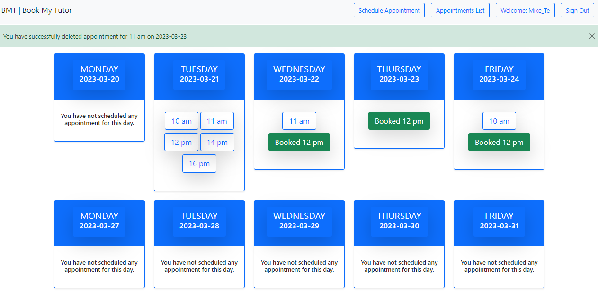
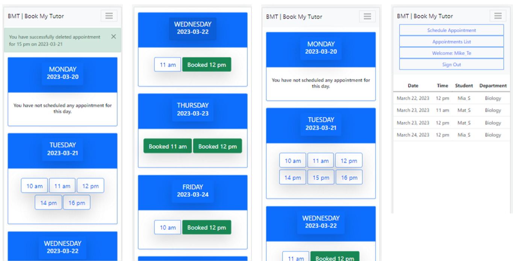
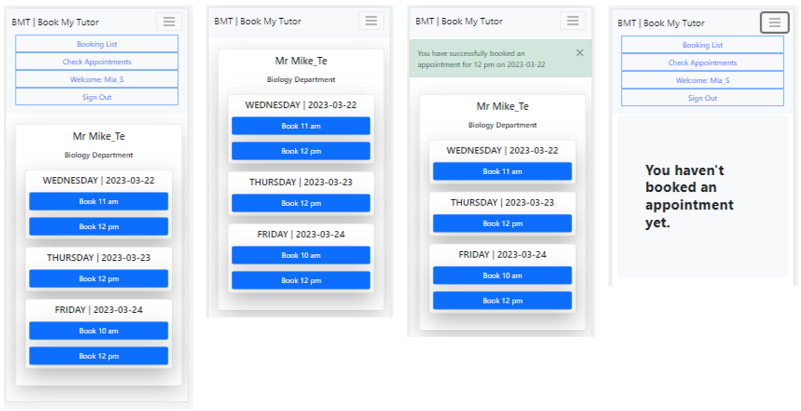

# BookMyTutor
#### The web-based booking system allows tutors to specify their availability by creating appointments throughout the day with predetermined time slots, ranging from 10 am to 11 am, 12 pm, 2 pm, 3 pm, and 4 pm. Students who have been assigned to a particular tutor can easily book appointments during the tutor's available time slots, subject to availability.

## Tutor view

   
  <em>Tutor dashboard | desktop view</em>

### TutorUser Functionality

When UserTutor logs in, they are presented with a list of present and future appointments (3.1.1). The list is displayed as a block of dated cards, starting with the current date and displaying from 5 to 10 future day-cards. 

Each card contains a list of available and booked time-slots, displaying the time and state of each time-slot (3.1.3). By clicking on the time-lot card UserTutor is able to cancel an available single time-slot at any time if necessary (3.1.4).  

UserTutor is able to generate all available time-slots for a certain day with one click on a day date card. (3.1.5). Available time slots: 10 am, 11 am, 12 pm, 2 pm, 3 pm, and 4 pm.

   
  <em>Tutor dashboard | mobile view</em>

## Student view
### StudentUser Functionality

When the UserStudent logs in, they are presented with a Home View that displays a list of available appointments provided only by their assigned UserTutor(2.2.1). The list starts from the tomorrow day and extends up to a period of two weeks. Each day in the list contains a list of available appointments represented as one-hour time slots.

Each time-slot displays the time of the appointment and acts as an active button(2.2.3). When the UserStudent clicks on a time-slot button, it disappears from the list, and a message confirming the booking is displayed on the screen(2.2.4). 

When a UserStudent books an appointment, the system displays a message to the UserStudent, confirming the booking of an appointment(2.2.8).

To prevent UserStudents from booking too many appointments, the system limits the number of bookings per user(2.2.9). The functionality for booking appointments is designed with this limitation in mind, and an appropriate message to the UserStudent if they attempt to exceed the booking limit(2.2.10). This helps to ensure that the appointment booking process remains fair and equitable for all users.

In addition to booking appointments, UserStudents can view a list of past and future appointments(2.3.1). Future/Active appointment can be cancelled if needed(2.3.2). 

   
  <em>Student dashboard | mobile view</em>

